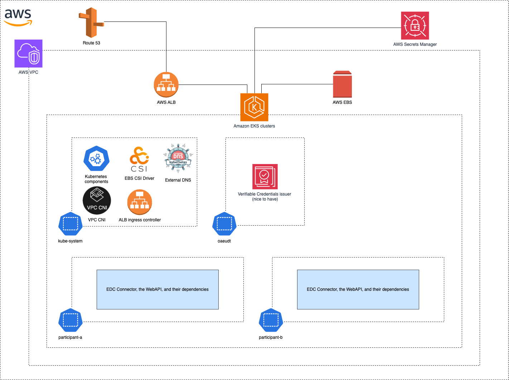

# OAEBUDT Dataspace

**OAEBUDT Dataspace** is an open-source proof-of-concept (PoC) project focused on building a modular, secure, and cloud-native dataspace infrastructure to support the trusted exchange of open access (OA) book usage data.

---

## 🚀 Project Overview

This project is part of the [OA Book Usage Data Trust (OAEBUDT)](https://www.oabookusage.org/), an international initiative aimed at creating a reliable and transparent framework for collecting, managing, and sharing usage data for open access books.

The OAEBUDT Dataspace enables:

- ✅ **Trusted data sharing** among participating institutions
- 🔄 **Interoperability** through open standards and shared protocols
- 🛡️ **Data sovereignty** with participant-controlled governance
- 🧾 **Decentralized identity** for secure, privacy-preserving access control
- 🧱 **Modular architecture** using modern, cloud-native technologies

---

## 🎯 Objective

The goal of the OAEBUDT Dataspace is to set up a federated data infrastructure that allows six pilot partners to securely publish, share, and access OA book usage data. This infrastructure supports compliance, transparency, and analytics across the data ecosystem.

---

## 🧱 Built With

The dataspace is based on components from the [Eclipse Dataspace Connector (EDC)](https://projects.eclipse.org/projects/technology.edc), providing:

- Secure and policy-driven data transfer
- Identity and access management
- Extensibility for integration with existing systems

---

## 📁 Project Structure

- [`connector/`](./connector): Contains the Eclipse Dataspace Connector setup and its extensions, encapsulated within a Helm chart. This enables seamless deployment and management of the connector in Kubernetes environments, following Helm best practices.

- [`infrastructure/`](./infrastructure): Includes Terraform scripts and configurations for deploying resources on AWS. It follows modular and environment-specific best practices for maintainable infrastructure-as-code.

- [`docs/`](./docs): Contains documentation including system architecture diagrams, deployment instructions, and user guides.

---

## 🏗️ Architecture

The project follows a Proof-of-Concept (PoC) architecture demonstrating the core components and their interactions.

---

## ☁️ AWS Deployment Architecture

This diagram shows how the components are deployed and orchestrated in the AWS cloud environment.

---
 ## Licensing

This project is licensed under the Apache License 2.0. See the [LICENSE](LICENSE) 